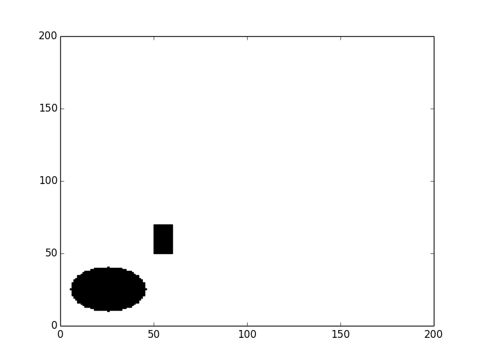
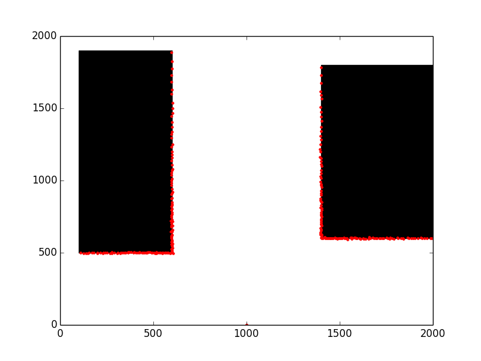

# AGVPlatform

> simulation platform for AGV's localization in indoor environment 
> AGV室内环境试验平台

## 目录结构
├ algorithm    用于存放常用算法     
├ dataFactory  产生数据      
├ figure       绘制图     
├ map          各种地图类     
├ sensor       各种传感器    
├ xlab         存放各种试验    

## 核心目录/类
**map目录**

> 该目录下目前只实现了一个map2D类，该类表示一个栅格地图


1. 该栅格地图存储在宽高设定的二维数组中
2. unknown = 0 表示未知 occupied = 1表示该位置已经占用
3. 支持三种类型添加特征分别是Feature.rectangle（矩形）、Feature.ellipse（椭圆）和Feature.erase（擦除矩形）用于消除已经占用部分
4. 特征在地图中表示地图的障碍物，记为已占用，而其他表示为未知，即非占用状态（不严谨）
5. 各种特征组合可以构成较为丰富的模型，如后续介绍的🚗汽车模型

以下展示一个地图中绘制了一个矩形和一个椭圆的情况


```
// code 位于figure下mapFigure.py __TestBasicDrawFunc()方法
# 首先创建一个200x200地图
map = Map2D(200, 200)
# 地图中添加一个矩形
map.addFeature(Map2D.Feature(Map2D.Feature.rectangle, [50, 50, 10, 20]))
# 创建一个50x50的另一个地图
map2 = Map2D(50, 50)
# 添加椭圆特征
map2.addFeature(Map2D.Feature(Map2D.Feature.ellipse, [25, 25, 40, 30, 0]))
# map融合map2，把map2放到0，0位置
map.addSubMap(map2, 0, 0)
# 以下是画图部分
fig = MapFigure(map)
fig.drawMapByGrids() # This one is slow
fig.setXYLim(0, 200, 0, 200)
fig.showFigure()
```


**sensor目录**

> 该目录下目前只实现了一个radar2D类，该类表示虚拟激光雷达

1. 构建激光雷达接收一下参数

angles|lines|distance|size|sd|dysd|failureVal
------|-----|--------|--------|-------|-----------|--------------
激光雷达扫描起始角和结束角|扫描范围内包含多少条线|扫描最大距离|扫描最小分辨率|扫描数据标准差|是否自适应扫描误差|测量失败时数据值
无默认值|无默认值|无默认值|1mm|10(1m远)|true(根据测量长度动态缩放误差)|默认0

使用时至少输入前面三个参数就可以构建基本的雷达类

2. getMeasureData方法
该方法用于获取雷达模型位于map类中的数据，方法接收两个参数
分别是地图实例和雷达在地图的位置
返回一个数组，数据每项表示一个测量点，测量点包含三个信息分别是x、y坐标以及测量长度

通过该传感器可以轻松获取扫描信息，以下展示激光雷达扫描有两个障碍物的情景



```
// 以下展示如何创建激光雷达数据
// code 位于figure下mapFigure.py __TestBasicDrawFunc()方法
# 创建一个大地图
map = Map2D(2000, 2000)
# 添加两个矩形障碍物
map.addFeature(Map2D.Feature(Map2D.Feature.rectangle, [100, 500, 500, 1400]))
map.addFeature(Map2D.Feature(Map2D.Feature.rectangle, [1400, 600, 600, 1200]))

# 创建雷达类&&获取位置点
radar = Radar2D([0, math.pi], 510, 5600, 1, 5)
radar_pos = radar.getMeasureData(map, [1000, 0, 0])

fig = MapFigure(map)
fig.drawMapByFeatures()
fig.drawRadarPoints([x[0] for x in radar_pos], [x[1] for x in radar_pos], 'r.')
fig.setXYLim(0, 2000, 0, 2000)
fig.showFigure()
```